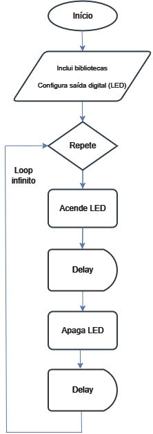

# Blink
A seguir desenvolvemos, passo a passo,  as etapas de síntese de um programa - em linguagem C - para controlar o piscar de um LED, presente na BitDogLab, utilizando um GPIO (General Purpose Input/Output) configurado como saída digital.
 
## Atividade: 
Vamos desenvolver um programa - em C - para acionar um LED RGB em que o pino azul está conectado ao GPIO 12 da BitDogLab. Ao configurar o pino em nível lógico alto, o LED acende na cor azul; em nível lógico baixo, ele apaga. O programa deve ser estruturado para realizar estas tarefas de forma repetitiva, de forma a acender e apagar o LED continuamente - fazendo-o piscar.

## Desenvolvimento:
Como ponto de partida, precisamos configurar a interface de saída (pino no LED) que será usada no nosso hardware para implementar este projeto. Como não há entrada de dados, seguimos para o loop, que se repete indefinidamente acendendo e apagando o LED.
Note que há linhas de delay, usadas para manter o LED aceso por um tempo (quando nível lógico alto) ou apagado por um tempo (quando nível lógico baixo), de forma que o piscar do LED seja perceptível.
Para definir o passo a passo do pseudocódigo, fazemos uso de um fluxograma.


Figura: Fluxograma do código para fazer o LED piscar (acende e apaga com delay entre as ações). OBS: Editado no Drawio.

A partir deste fluxograma, podemos destacar e detalhar as seguintes etapas principais num novo documento chamado de pseudocódigo:

- **Início:** Representa o ponto de partida do programa.
- **Configuração de Inicialização:** O programa começa incluindo bibliotecas e configurando a saída digital que será estruturada para fazer o LED piscar.
- **Loop Infinito:** Uma estrutura de repetição (loop) onde o programa executa repetidas vezes a ação de acender e apagar o LED, com um certo tempo de espera entre as ações.
 a. *Acende LED:* Configura-se o nível lógico de saída do GPIO 12 como alto, fazendo o LED acender na cor azul.
 b. *Delay:* O programa fica inativo por um certo tempo, com o LED permanecendo aceso neste período.
 c. *Apaga LED:* Em seguida, o programa configura o nível lógico de saída do GPIO 12 como baixo, fazendo o LED apagar.
 d. *Delay:* O programa fica inativo novamente, e o LED fica apagado enquanto isso.
- **Retorno ao Início do Loop:** Ao fim do processo abcd, o programa retorna ao início do loop, onde ele acende novamente o LED e prossegue com os outros passos, repetindo o ciclo indefinidamente.

Na etapa seguinte, podemos transcrever o pseudocódigo em um programa, escolhendo alguma linguagem específica, respeitando sua sintaxe e convenções. Esta construção pode ser realizada etapa por etapa, respeitando a sequência do pseudocódigo, ou então pode ser reaproveitada de um repositório. Normalmente é aqui que o desenvolvedor investe um certo tempo, depurando o código e testando, até que o resultado atenda às suas expectativas.

No caso desta atividade vamos usar C. Segue o código em linguagem C para a ação de piscar o LED:

## Pseudocódigo - Linguagem C

**Início:** Representa o ponto de partida do programa. Para começar, incluímos um comentário como cabeçalho.

```c
/**
 * Embarcatech 
 * Exemplo Blink com a BitDogLab
 */
```

**Inclusão de Biblioteca:** Inclui a biblioteca "pico/stdlib.h" para acessar funções de GPIO e temporização.

```c
#include "pico/stdlib.h"
```

**Definições e Configurações:** Define o pino do LED onde ele está conectado (exemplo: GPIO 12). Inicializa o pino do LED e configura-o como saída.

```c
int main() {
    // Define o pino do LED e o configura como saída
    const uint LED_PIN = 12;  // Substitua com o número do GPIO desejado
    gpio_init(LED_PIN);
    gpio_set_dir(LED_PIN, GPIO_OUT);
```

**Loop Infinito:**
- Define a condição, que é sempre verdadeira, para repetir o loop.
- Liga o LED.
- Aguarda pelo tempo de atraso e define para 250ms.
- Desliga o LED.
- Aguarda pelo tempo de atraso.
- Fim

```c
    while (true) {
        // Liga o LED
        gpio_put(LED_PIN, true);
        sleep_ms(250);  // Espera 250ms

        // Desliga o LED
        gpio_put(LED_PIN, false);
        sleep_ms(250);  // Espera 250ms
    }
}
```

## Código completo em C

```c
/**
 * Embarcatech 
 * Exemplo Blink com a BitDogLab
 */

#include "pico/stdlib.h"

int main() {
    // Define o pino do LED e o configura como saída
    const uint LED_PIN = 12;  // Substitua com o número do GPIO desejado
    gpio_init(LED_PIN);
    gpio_set_dir(LED_PIN, GPIO_OUT);

    while (true) {
        // Liga o LED
        gpio_put(LED_PIN, true);
        sleep_ms(250);  // Espera 250ms

        // Desliga o LED
        gpio_put(LED_PIN, false);
        sleep_ms(250);  // Espera 250ms
    }
}
```

## Arquivo CMake
Além do arquivo em C (extensão .c), é necessário configurar um arquivo CMake para compilar e executar o programa no microprocessador. Este arquivo define as configurações de build do projeto, como as bibliotecas que serão usadas, os arquivos de origem e as especificações do sistema.
Aqui está um exemplo básico do CMakeLists.txt para nosso projeto do blink:

## CMakeLists.txt

```ruby
# Define a versão mínima do CMake que será utilizada
cmake_minimum_required(VERSION 3.13)

# Define o nome do projeto
project(blink C CXX ASM)

# Define a versão do padrão C a ser utilizada
set(CMAKE_C_STANDARD 11)  # Uso do C11
set(CMAKE_CXX_STANDARD 17)  # Caso utilize C++ no projeto futuro

# Inclui o SDK do Raspberry Pi Pico
# Essa variável deve ser configurada previamente no ambiente
include($ENV{PICO_SDK_PATH}/pico_sdk_init.cmake)

# Inicializa o SDK do Raspberry Pi Pico
pico_sdk_init()

# Adiciona o arquivo principal ao projeto
add_executable(blink
    main.c  # Substitua pelo nome do arquivo se diferente
)

# Alinha o projeto com as bibliotecas padrão da Pico
target_link_libraries(blink pico_stdlib)

# Define o nome da placa (pico ou pico_w, conforme o hardware)
pico_add_extra_outputs(blink)

# Adiciona suporte às bibliotecas necessárias
# A função pico_enable_stdio_* habilita saída pela UART ou USB
pico_enable_stdio_uart(blink 1)  # Habilita saída pela UART (1 = ativo)
pico_enable_stdio_usb(blink 0)   # Desativa saída pela USB (0 = inativo)

# Comentário: Essa configuração faz o link com as bibliotecas básicas
# e configura o suporte de entrada/saída para o projeto.
```


Explicação dos principais comandos do CMAKE:
- cmake_minimum_required: Garante que o CMake usado seja compatível com os comandos do projeto.
- project: Define o nome do projeto.
- set: Configura os padrões de C e C++.
- include: Inclui os arquivos do SDK do Raspberry Pi Pico, necessários para compilar o projeto.
- pico_sdk_init: Inicializa o SDK.
- add_executable: Especifica o nome do executável e os arquivos de código-fonte que farão parte do projeto.
- target_link_libraries: Vincula as bibliotecas padrão necessárias, como pico_stdlib.
- pico_add_extra_outputs: Gera os arquivos necessários para gravar o programa na placa (ex.: .uf2).
- pico_enable_stdio_*: Controla a saída de depuração, permitindo exibir logs pela UART ou USB.


## Sobre o hardware da BitDogLab:
Um LED RGB, cátodo comum, tem o eletrodo do vermelho lidado no GPIO 13 através de um resistor de 220 ohm, o pino de verde está ligado no GPIO 11 também através de um resistor de 220 ohm e o pino do azul no GPIO 12 através de um resistor de 150 ohm.


## Exercício:
Faça uma adaptação neste código em C de forma que o programa pisque o LED na cor vermelha e também na cor verde. Comece pelo fluxograma, depois modifique o pseudocódigo, e por fim implemente e depure seu código em C. Faça um vídeo, de no máximo 15 segundos, mostrando seu funcionamento e carregue no Moodle.
