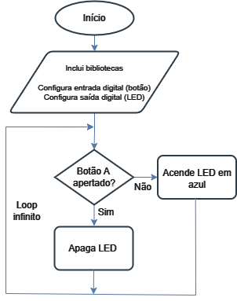

# Botão (Button)
A seguir desenvolvemos, passo a passo,  as etapas de síntese de um programa - em linguagem C - para utilizar os botões presentes na BitDogLab para controlar o estado do LED (aceso ou apagado), através da configuração dos GPIOs como entradas digitais.

## Atividade:
Vamos desenvolver um programa - em C - para apagar, com o pressionar do Botão A, um LED aceso indefinidamente (em azul). Note que o dado de entrada é dado pelo estado do botão: solto ou apertado, por outro lado, o dado de saída é sinalizado pelo LED RGB: apagado ou aceso (na cor do pino conectado). Com o pressionar do botão, modificamos o nível lógico do LED, fazendo-o apagar quando o botão está apertado. Note que o pino azul do LED está conectado ao GPIO 12 da BitDogLab, enquanto o pino do Botão A está conectado ao GPIO 5.

## Desenvolvimento:

Como ponto de partida, configuramos as interfaces de entrada (pino do botão) e saída (pino no LED) que serão usadas no nosso hardware para implementar este projeto. Em seguida, define-se um loop, para que o programa leia os dados de entrada e processe a saída indefinidamente.

O processamento é definido por:

- Botão solto >>> GPIO5 = HIGH (nível alto) >>> GPIO12 = GPIO5; LED RGB acende na cor azul;
- Botão apertado >>> GPIO5 = LOW (nível alto) >>> GPIO12 = GPIO5; LED RGB apaga.

Para definir o passo a passo do pseudocódigo, fazemos uso de um fluxograma.


Figura: Fluxograma do código para fazer o botão controlar o estado do LED RGB. OBS: Editado no Drawio.

A partir deste fluxograma, podemos destacar e detalhar as etapas principais no pseudocódigo. O fluxograma parte do Início, inclui bibliotecas e configura entrada (botão) e saída (LED). Observe que neste fluxograma há uma condição dentro de um loop. Esta condição estabelece o caminho dentro do fluxograma.

## Pseudocódigo - Linguagem C

**Início:** Representa o ponto de partida do programa. Incluímos um comentário inicial.

```c
/** Embarcatech Exemplo Botão com a BitDogLab */
```

**Inclusão de Biblioteca:** Chamamos a biblioteca padrão para GPIO e temporização.

```c
#include "pico/stdlib.h"
```

**Definições:** Definimos os pinos para o LED azul e o Botão A.

```c
#define LED_BLUE 12
#define BUTTON_A 5
```

**Início do Programa:** Ponto de entrada da execução.

```c
int main() {
```

**Configuração do GPIO do LED como saída:** Inicializa o pino e o configura como saída.

```c
gpio_init(LED_BLUE);
gpio_set_dir(LED_BLUE, GPIO_OUT);
gpio_put(LED_BLUE, false);
```

**Configuração do GPIO do Botão como entrada com pull-up interno:** Inicializa o pino e ativa o resistor interno.

```c
gpio_init(BUTTON_A);
gpio_set_dir(BUTTON_A, GPIO_IN);
gpio_pull_up(BUTTON_A);
```

**Loop Infinito:** O programa executa continuamente a leitura do botão e controla o LED.

```c
while (true) {
```

**Leitura do estado do Botão A:** Verifica se o botão está pressionado (LOW) ou solto (HIGH).

```c
bool button_a_state = gpio_get(BUTTON_A);
```

**Atualiza o estado do LED com base no botão:** Acende ou apaga o LED azul.

```c
gpio_put(LED_BLUE, button_a_state);
```

**Delay para evitar problemas de debounce:** Aguarda brevemente antes de repetir o loop.

```c
sleep_ms(50);
```

**Fim do Loop:** Retorna ao início para continuar a leitura do botão.

```c
   }
}
```

## Código completo em C

```c
Código completo em C   
/**
 * Embarcatech 
 * Exemplo Botão com a BitDogLab
 */

#include "pico/stdlib.h"

#define LED_BLUE 12   // GPIO conectado ao terminal azul do LED RGB
#define BUTTON_A 5    // GPIO conectado ao Botão A

int main() {
    // Configuração do GPIO do LED como saída
    gpio_init(LED_BLUE);
    gpio_set_dir(LED_BLUE, GPIO_OUT);
    gpio_put(LED_BLUE, false);  // Inicialmente, o LED está apagado

    // Configuração do GPIO do Botão A como entrada com pull-up interno
    gpio_init(BUTTON_A);
    gpio_set_dir(BUTTON_A, GPIO_IN);
    gpio_pull_up(BUTTON_A);

    while (true) {
        // Lê o estado do Botão A
        bool button_a_state = gpio_get(BUTTON_A);  // HIGH = solto, LOW = pressionado

        // Atualiza o estado do LED com base no estado do Botão A
        gpio_put(LED_BLUE, button_a_state);  // Se solto (HIGH), LED acende; se pressionado (LOW), apaga

        // Pequeno delay para evitar leituras inconsistentes (debounce simples)
        sleep_ms(50);
    }
}
```

## Arquivo CMake

Lembre-se que antes de validar nosso algoritmo precisamos fazer algumas definições de compilação usando o CMake.

O arquivo CMakeLists.txt é essencial para configurar como o programa será compilado e vinculado às bibliotecas necessárias. Ele atua como uma "receita" para o CMake criar o arquivo binário final que será carregado na Raspberry Pi Pico.

Considere que o nome do projeto é "button_led_control".

## CMakeLists.txt

```ruby
# Define a versão mínima do CMake necessária para o projeto
cmake_minimum_required(VERSION 3.13)

# Define o nome do projeto. Pode ser qualquer nome, mas deve ser significativo.
project(button_led_control C CXX ASM)

# Define o padrão de linguagem C e C++ para o projeto
set(CMAKE_C_STANDARD 11)  # Utilizamos o padrão C11 para maior compatibilidade
set(CMAKE_CXX_STANDARD 17)  # Caso use C++, definimos o padrão C++17

# Inclui o SDK do Raspberry Pi Pico. Ele é necessário para compilar o projeto.
# Esta variável deve estar configurada no ambiente como PICO_SDK_PATH.
include($ENV{PICO_SDK_PATH}/pico_sdk_init.cmake)

# Inicializa o SDK do Raspberry Pi Pico. Ele prepara as bibliotecas padrão para uso.
pico_sdk_init()

# Adiciona o arquivo principal ao projeto. Este será o código-fonte do programa.
add_executable(button_led_control
    main.c  # Substitua pelo nome do arquivo, se for diferente.
)

# Vincula as bibliotecas padrão do Raspberry Pi Pico ao projeto.
# `pico_stdlib` inclui funções essenciais, como manipulação de GPIOs e temporização.
target_link_libraries(button_led_control pico_stdlib)

# Gera arquivos de saída adicionais (.bin, .uf2, etc.) necessários para gravar na placa.
pico_add_extra_outputs(button_led_control)

# Ativa a saída de depuração via UART (opcional).
# Útil para verificar logs ou mensagens durante o desenvolvimento.
pico_enable_stdio_uart(button_led_control 1)

# Desativa a saída de depuração via USB (opcional).
# Normalmente, deixamos desativado se não estamos usando USB para depuração.
pico_enable_stdio_usb(button_led_control 0)
```

Explicação do arquivo CMakeLists.txt:
- cmake_minimum_required(VERSION 3.13): Define a versão mínima do CMake que será usada para configurar o projeto. A versão 3.13 é a mínima recomendada para projetos com o Raspberry Pi Pico.
- project(button_led_control C CXX ASM): Define o nome do projeto (neste caso, button_led_control) e as linguagens que serão usadas: C, C++, e Assembly (ASM). É importante incluir CXX (C++) e ASM mesmo que o projeto principal seja em C, pois algumas bibliotecas podem usar essas linguagens.
- set(CMAKE_C_STANDARD 11): Especifica o padrão de linguagem C utilizado no projeto. Aqui, escolhemos o C11 por ser moderno e amplamente suportado.
- set(CMAKE_CXX_STANDARD 17): Define o padrão de C++ como C++17, caso algum arquivo de código-fonte ou biblioteca utilize essa linguagem.
- include($ENV{PICO_SDK_PATH}/pico_sdk_init.cmake): Inclui o arquivo de configuração do SDK do Raspberry Pi Pico. A variável PICO_SDK_PATH precisa estar configurada no sistema para apontar para a pasta onde o SDK foi instalado.
- pico_sdk_init(): Inicializa o SDK, preparando as bibliotecas e as configurações padrão para o projeto.
- add_executable(button_led_control main.c): Cria um executável para o projeto a partir do arquivo main.c. Substitua main.c pelo nome do arquivo principal, se for diferente.
- target_link_libraries(button_led_control pico_stdlib): Conecta as bibliotecas padrão do Pico ao executável. A biblioteca pico_stdlib inclui funções básicas, como configuração de GPIOs, controle de temporização (sleep_ms), e manipulação de UART/USB.
- pico_add_extra_outputs(button_led_control): Gera arquivos extras, como .uf2, .hex, e .bin, que podem ser usados para gravar o programa na Raspberry Pi Pico. O arquivo .uf2 é o formato mais comum para carregar na Pico.
- pico_enable_stdio_uart(button_led_control 1): Habilita a saída de depuração via UART (Universal Asynchronous Receiver-Transmitter). Se ativado (1), você pode usar um cabo serial para monitorar logs ou mensagens do programa em tempo real.
- pico_enable_stdio_usb(button_led_control 0): Desabilita a saída de depuração via USB. Se você não precisa usar a USB para logs ou mensagens, desative (0) para liberar recursos.

## Exercício:
Faça uma adaptação neste código em C de forma que o LED RGB comece apagado e acenda em azul se o Botão A for apertado e acenda em vermelho se o Botão B for apertado. Além disso, faça o LED acender em lilás se ambos os botões forem apertados ao mesmo tempo. Comece pelo fluxograma, depois modifique o pseudocódigo e por fim implemente e depure seu código em C. Faça um vídeo, de no máximo 15 segundos, mostrando seu funcionamento e carregue no Moodle.
