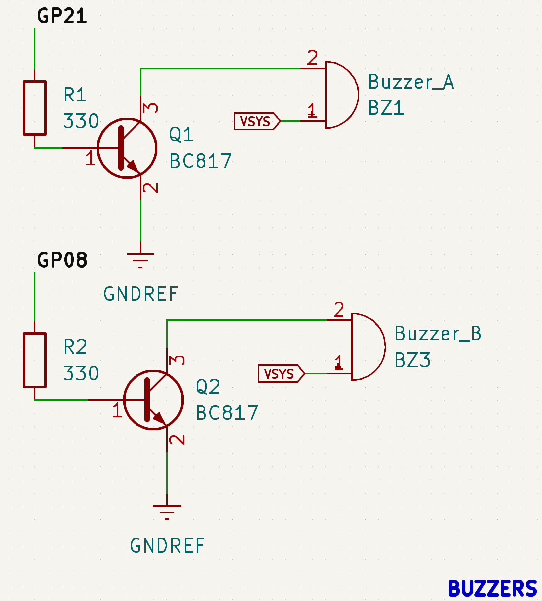
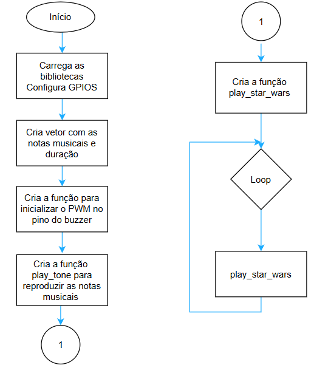

# Buzzer

A seguir desenvolvemos, passo a passo, as etapas de síntese de um programa - em linguagem C - para acionar o buzzer presente na BitDogLab.

## Atividade:

Vamos desenvolver um programa - em C - para acionar, com o uso de uma GPIO (Gate Programmable Input/Output), o buzzer presente na placa BitDogLab. Note que o buzzer utilizado está conectado à GPIO 21.

## Desenvolvimento:

Como ponto de partida, precisamos configurar a interface de saída (no caso, o buzzer) que será usada no nosso hardware para implementar este projeto.

A interface de saída é um componente denominado buzzer que emite um sinal sonoro quando é acionado. Existem dois tipos principais de buzzers: passivos e ativos. O buzzer passivo requer um sinal externo - com frequência variável - para gerar som, enquanto o buzzer ativo pode gerar som por si só - com frequência fixa - quando conectado a uma fonte de alimentação. A BitDogLab possui dois buzzers passivos (A e B) que podem ser acionados de forma independente e com frequências diferentes.

### Como funciona:

Um buzzer passivo funciona de maneira similar a um alto-falante básico, utilizando uma bobina eletromagnética e uma membrana para produzir som.

Quando um sinal elétrico variável é aplicado à bobina, ele cria um campo magnético que interage com um imã, resultando no movimento da bobina e, consequentemente, da membrana. Esse movimento faz a membrana vibrar, deslocando o ar ao seu redor e produzindo ondas acústicas que são percebidas como som.

### Como a música é produzida utilizando o buzzer?

O som é uma onda que se propaga através de um meio, como ar, água ou sólidos. Essas ondas são criadas por vibrações que deslocam as partículas do meio ao redor.

- **Frequência:** A frequência do som, medida em Hertz (Hz), determina o quão aguda ou grave é a onda sonora. Sons com frequências mais altas são percebidos como tons mais agudos, enquanto frequências mais baixas são percebidas como tons mais graves.
- **Amplitude:** A amplitude da onda sonora determina o volume do som. Amplitudes maiores resultam em sons mais altos, enquanto amplitudes menores produzem sons mais baixos.

Para controlar um buzzer passivo, é comum usar uma técnica chamada PWM (Modulação por Largura de Pulso). Ao ajustar a frequência do sinal PWM, é possível gerar diferentes tons.

Entender a matemática do som é essencial para utilizar buzzers de forma eficaz. Controlar a frequência e a amplitude permite criar uma ampla gama de sons, desde simples beeps até melodias complexas.
Na Figura é possível visualizar o aspecto físico do buzzer e seu esquema de ligação presente na BitDog Lab.



Figura: Foto do buzzer e seu esquema elétrico com as GPIOs que controlam os buzzers A e B.

O buzzer A possui dois terminais: o terminal 1 está conectado ao VSYS da Raspberry Pi Pico, onde a tensão em VSYS é de 5V, e o terminal 2 está conectado ao coletor de um transistor. A base deste transistor está conectada ao GPIO 21 da Raspberry Pi Pico. O VSYS é uma linha de alimentação no Raspberry Pi Pico que fornece energia para o regulador de 3,3V, responsável por alimentar o núcleo e os periféricos do microcontrolador. Aqui estão alguns detalhes importantes sobre o VSYS no Raspberry Pi Pico:

- **Entrada de Energia:**
    - Pode ser alimentado por uma fonte de tensão externa (como uma bateria ou adaptador) ou via USB;
    - A tensão nominal de entrada para o VSYS é de 1,8V a 5,5V;
- **Conexão com o Regulador Interno:**
    - O regulador interno converte a tensão do VSYS para 3,3V (VREG), usada para alimentar os circuitos do microcontrolador;
- **Fontes de Alimentação Prioritárias:**
    - Se o Raspberry Pi Pico for alimentado tanto via USB quanto por VSYS, a prioridade será dada ao VSYS.

Quando o transistor é acionado, o terminal 2 do buzzer é conectado ao GND, permitindo a passagem de corrente e, assim, acionando o buzzer.

Não é possível acionar o buzzer diretamente com uma GPIO da Raspberry Pi Pico devido à corrente necessária para o acionamento, que excede os 12 mA suportados pela GPIO da placa, por isso a mediação é feita com um transistor, que amplifica a corrente que passa pelo buzzer.

A BitDogLab oferece uma solução inovadora para a criação de som em modo estéreo, utilizando dois buzzers (A e B) simultaneamente, permitindo a emissão de sons distintos em cada canal, seja o esquerdo ou o direito. Isso não só enriquece a experiência auditiva, como também amplia as possibilidades de design de som, permitindo a criação de efeitos sonoros mais detalhados e imersivos. A reprodução estéreo é particularmente útil para criar efeitos tridimensionais no áudio, onde o ouvinte pode perceber a origem do som em diferentes direções, aprimorando a percepção espacial.

Essa funcionalidade permite diversas aplicações, como a separação de instrumentos musicais ou trilhas de áudio em diferentes canais, onde, por exemplo, a melodia pode ser tocada em um buzzer enquanto o acompanhamento é executado no outro. Essa técnica também é útil para reproduzir sons que possuem divisões entre o canal esquerdo e o direito, comuns em áudios com efeito surround, criando uma experiência sonora mais envolvente e próxima da realidade.

Com o GPIO necessário para acionar o buzzer definido, podemos desenhar o fluxograma contendo a lógica necessária para o acionamento do buzzer.


Figura: Fluxograma do código para fazer o buzzer emitir os sons/as músicas desejadas. OBS: Editado no Drawio.

Neste fluxograma, vamos destacar e detalhar as seguintes etapas principais em um novo documento chamado de pseudocódigo.

- **Início:** Representa o ponto de partida do programa.
- **Carrega as bibliotecas da Raspberry Pico e configura as GPIOs:** O programa começa incluindo as bibliotecas necessárias para acionar ou realizar a leitura de periféricos conectados à Raspberry Pico e configura a GPIO 21, à qual o buzzer está conectado, como saída.
- **Cria um vetor com as notas musicais:** Neste vetor são armazenadas as frequências em Hz de cada nota musical.
- **Cria um vetor com a duração em milissegundo:** Neste segundo vetor são armazenadas a duração de cada nota musical.
- **Cria uma função para inicializar o PWM no pino do buzzer:** Esta função configura o pino ao qual o buzzer está conectado, inicializa o PWM (Modulação por Largura de Pulso), configura sua resolução, o clock para gerar a frequência do PWM e o Duty Cycle.
- **Cria uma função para reproduzir as notas musicais (play_tone):** Esta função reproduz uma nota musical de acordo com a frequência e duração especificadas.
- **Cria a função para reproduzir a musica tema do Star Wars (play_star_wars):** Esta função irá reproduzir a música do Star Wars de acordo com a frequência e duração especificadas.
- **Loop Infinito:** Uma estrutura de repetição (loop) onde o programa realiza o acionamento do buzzer, espera um tempo determinado, desliga o buzzer, espera um tempo determinado e repete o processo. Esse loop continuará a execução indefinidamente.

Na etapa seguinte, podemos transcrever o pseudocódigo em um programa, escolhendo alguma linguagem específica, respeitando sua sintaxe e convenções. Esta construção pode ser realizada etapa por etapa, respeitando a sequência do pseudocódigo, ou então pode ser reaproveitada de um repositório. Normalmente é aqui que o desenvolvedor investe um certo tempo, depurando o código e testando, até que o resultado atenda às suas expectativas.

No caso desta atividade vamos usar C. Segue o código em linguagem C para o acionamento do buzzer:

[Fonte de referência](https://escola-4-ponto-zero.notion.site/Introdu-o-pr-tica-a-BitDogLab-f9bb8dfe2d0b46b2918f74aa6991a8cc#dd5917d95c90492b961591afd8a1a65f)

## Pseudocódigo - Linguagem C

**Início:** Representa o ponto de partida do programa. Para começar, incluímos um comentário e a referência.

```c
/**
 * Exemplo de acionamento do buzzer utilizando sinal PWM no GPIO 21 da Raspberry Pico / BitDogLab
 * 06/12/2024
 */
```

**Carrega as bibliotecas da Raspberry Pico e configura as GPIOs:** O programa começa carregando as bibliotecas necessárias para controle dos periféricos de hardware da Raspberry Pico: *pico/stdlib.h*, *hardware/pwm.h*, e *hardware/clocks.h*.

```c
#include <stdio.h>
#include "pico/stdlib.h"
#include "hardware/pwm.h"
#include "hardware/clocks.h"

// Configuração do pino do buzzer
#define BUZZER_PIN 21
```

Cria um vetor chamado star_wars_notes que contém a frequência das notas da música tema do Star Wars.

```c
// Notas musicais para a música tema de Star Wars
const uint star_wars_notes[] = {
    330, 330, 330, 262, 392, 523, 330, 262,
    392, 523, 330, 659, 659, 659, 698, 523,
    415, 349, 330, 262, 392, 523, 330, 262,
    392, 523, 330, 659, 659, 659, 698, 523,
    415, 349, 330, 523, 494, 440, 392, 330,
    659, 784, 659, 523, 494, 440, 392, 330,
    659, 659, 330, 784, 880, 698, 784, 659,
    523, 494, 440, 392, 659, 784, 659, 523,
    494, 440, 392, 330, 659, 523, 659, 262,
    330, 294, 247, 262, 220, 262, 330, 262,
    330, 294, 247, 262, 330, 392, 523, 440,
    349, 330, 659, 784, 659, 523, 494, 440,
    392, 659, 784, 659, 523, 494, 440, 392
};
```

Cria um vetor com a duração em milissegundos de cada nota.

```c
// Duração das notas em milissegundos
const uint note_duration[] = {
    500, 500, 500, 350, 150, 300, 500, 350,
    150, 300, 500, 500, 500, 500, 350, 150,
    300, 500, 500, 350, 150, 300, 500, 350,
    150, 300, 650, 500, 150, 300, 500, 350,
    150, 300, 500, 150, 300, 500, 350, 150,
    300, 650, 500, 350, 150, 300, 500, 350,
    150, 300, 500, 500, 500, 500, 350, 150,
    300, 500, 500, 350, 150, 300, 500, 350,
    150, 300, 500, 350, 150, 300, 500, 500,
    350, 150, 300, 500, 500, 350, 150, 300,
};
```

**void pwm_init_buzzer:** Responsável por realizar as configurações do PWM como resolução, frequência e Duty cycle.

```c
// Inicializa o PWM no pino do buzzer
void pwm_init_buzzer(uint pin) {
```

**gpio_set_function:** Associa o pino à funcionalidade de hardware correspondente (no caso, PWM).

```c
    gpio_set_function(pin, GPIO_FUNC_PWM);
```

**pwm_gpio_to_slice_num(pin):** Obtém informações do slice e canal associado ao GPIO.

```c
    uint slice_num = pwm_gpio_to_slice_num(pin);
```

O slice seria uma subdivisão do bloco do hardware PWM, ele está dividido em 8 slices independentes que podem ser controlados individualmente. Cada slice controla dois canais PWM: A e B.

**pwm_config:** Permite realizar as configurações do slice do PWM.

```c
    pwm_config config = pwm_get_default_config();
```

**Clock Divider:** Permite ajustar a frequência do PWM dividindo o clock base.

```c
    pwm_config_set_clkdiv(&config, 4.0f); // Ajusta divisor de clock
    pwm_init(slice_num, &config, true);
    pwm_set_gpio_level(pin, 0); // Desliga o PWM inicialmente
}
```

**void play_tone:** Função responsável por reproduzir a nota com frequência e duração especificada.

```c
// Toca uma nota com a frequência e duração especificadas
void play_tone(uint pin, uint frequency, uint duration_ms) {
    uint slice_num = pwm_gpio_to_slice_num(pin);
    uint32_t clock_freq = clock_get_hz(clk_sys); 
    uint32_t top = clock_freq / frequency - 1;
```

**Wrap Value:** Define o valor máximo do contador, influenciando a resolução do PWM.

```c
    pwm_set_wrap(slice_num, top);
    pwm_set_gpio_level(pin, top / 2); // 50% de duty cycle

    sleep_ms(duration_ms);

    pwm_set_gpio_level(pin, 0); // Desliga o som após a duração
    sleep_ms(50); // Pausa entre notas
}
```

**void play_star_wars:** Função responsável por reproduzir a música do Star Wars no pino ao qual o buzzer está ligado.

```c
// Função principal para tocar a música
void play_star_wars(uint pin) {
    for (int i = 0; i < sizeof(star_wars_notes) / sizeof(star_wars_notes[0]); i++) {
        if (star_wars_notes[i] == 0) {
            sleep_ms(note_duration[i]);
        } else {
            play_tone(pin, star_wars_notes[i], note_duration[i]);
        }
    }
}
```

**Loop Infinito:** Chama a função beep com o intervalo de tempo desejado que o buzzer deve ser acionado.

```c
int main() {
    stdio_init_all();
    pwm_init_buzzer(BUZZER_PIN);
    while(1){
      play_star_wars(BUZZER_PIN);
     
    }
   
    return 0;
}
```

## Código completo em C

```c
/**
 * Exemplo de acionamento do buzzer utilizando sinal PWM no GPIO 21 da Raspberry Pico / BitDogLab
 * 06/12/2024
 */

#include <stdio.h>
#include "pico/stdlib.h"
#include "hardware/pwm.h"
#include "hardware/clocks.h"

// Configuração do pino do buzzer
#define BUZZER_PIN 21

// Notas musicais para a música tema de Star Wars
const uint star_wars_notes[] = {
    330, 330, 330, 262, 392, 523, 330, 262,
    392, 523, 330, 659, 659, 659, 698, 523,
    415, 349, 330, 262, 392, 523, 330, 262,
    392, 523, 330, 659, 659, 659, 698, 523,
    415, 349, 330, 523, 494, 440, 392, 330,
    659, 784, 659, 523, 494, 440, 392, 330,
    659, 659, 330, 784, 880, 698, 784, 659,
    523, 494, 440, 392, 659, 784, 659, 523,
    494, 440, 392, 330, 659, 523, 659, 262,
    330, 294, 247, 262, 220, 262, 330, 262,
    330, 294, 247, 262, 330, 392, 523, 440,
    349, 330, 659, 784, 659, 523, 494, 440,
    392, 659, 784, 659, 523, 494, 440, 392
};

// Duração das notas em milissegundos
const uint note_duration[] = {
    500, 500, 500, 350, 150, 300, 500, 350,
    150, 300, 500, 500, 500, 500, 350, 150,
    300, 500, 500, 350, 150, 300, 500, 350,
    150, 300, 650, 500, 150, 300, 500, 350,
    150, 300, 500, 150, 300, 500, 350, 150,
    300, 650, 500, 350, 150, 300, 500, 350,
    150, 300, 500, 500, 500, 500, 350, 150,
    300, 500, 500, 350, 150, 300, 500, 350,
    150, 300, 500, 350, 150, 300, 500, 500,
    350, 150, 300, 500, 500, 350, 150, 300,
};

// Inicializa o PWM no pino do buzzer
void pwm_init_buzzer(uint pin) {
    gpio_set_function(pin, GPIO_FUNC_PWM);
    uint slice_num = pwm_gpio_to_slice_num(pin);
    pwm_config config = pwm_get_default_config();
    pwm_config_set_clkdiv(&config, 4.0f); // Ajusta divisor de clock
    pwm_init(slice_num, &config, true);
    pwm_set_gpio_level(pin, 0); // Desliga o PWM inicialmente
}

// Toca uma nota com a frequência e duração especificadas
void play_tone(uint pin, uint frequency, uint duration_ms) {
    uint slice_num = pwm_gpio_to_slice_num(pin);
    uint32_t clock_freq = clock_get_hz(clk_sys);
    uint32_t top = clock_freq / frequency - 1;

    pwm_set_wrap(slice_num, top);
    pwm_set_gpio_level(pin, top / 2); // 50% de duty cycle

    sleep_ms(duration_ms);

    pwm_set_gpio_level(pin, 0); // Desliga o som após a duração
    sleep_ms(50); // Pausa entre notas
}

// Função principal para tocar a música
void play_star_wars(uint pin) {
    for (int i = 0; i < sizeof(star_wars_notes) / sizeof(star_wars_notes[0]); i++) {
        if (star_wars_notes[i] == 0) {
            sleep_ms(note_duration[i]);
        } else {
            play_tone(pin, star_wars_notes[i], note_duration[i]);
        }
    }
}

int main() {
    stdio_init_all();
    pwm_init_buzzer(BUZZER_PIN);
    while(1){
      play_star_wars(BUZZER_PIN);
     
    }
   
    return 0;
}
```

## Arquivo CMake

Lembre-se que antes de validar nosso algoritmo precisamos fazer algumas definições de compilação usando o CMake.

O arquivo CMakeLists.txt é essencial para configurar como o programa será compilado e vinculado às bibliotecas necessárias. Ele atua como uma "receita" para o CMake criar o arquivo binário final que será carregado na Raspberry Pi Pico.

Considere que o nome do projeto é "buzzer_pwm1".

## CMakeLists.txt

```ruby
# Generated Cmake Pico project file

cmake_minimum_required(VERSION 3.13)

set(CMAKE_C_STANDARD 11)
set(CMAKE_CXX_STANDARD 17)
set(CMAKE_EXPORT_COMPILE_COMMANDS ON)

# Initialise pico_sdk from installed location
# (note this can come from environment, CMake cache etc)

# == DO NOT EDIT THE FOLLOWING LINES for the Raspberry Pi Pico VS Code Extension to work ==
if(WIN32)
    set(USERHOME $ENV{USERPROFILE})
else()
    set(USERHOME $ENV{HOME})
endif()
set(sdkVersion 2.1.0)
set(toolchainVersion 13_3_Rel1)
set(picotoolVersion 2.1.0)
set(picoVscode ${USERHOME}/.pico-sdk/cmake/pico-vscode.cmake)
if (EXISTS ${picoVscode})
    include(${picoVscode})
endif()
# ====================================================================================
set(PICO_BOARD pico_w CACHE STRING "Board type")

# Pull in Raspberry Pi Pico SDK (must be before project)
include(pico_sdk_import.cmake)

project(buzzer_pwm1 C CXX ASM)

# Initialise the Raspberry Pi Pico SDK
pico_sdk_init()

# Add executable. Default name is the project name, version 0.1

add_executable(buzzer_pwm1 buzzer_pwm1.c )

pico_set_program_name(buzzer_pwm1 "buzzer_pwm1")
pico_set_program_version(buzzer_pwm1 "0.1")

# Modify the below lines to enable/disable output over UART/USB
pico_enable_stdio_uart(buzzer_pwm1 0)
pico_enable_stdio_usb(buzzer_pwm1 0)

# Add the standard library to the build
target_link_libraries(buzzer_pwm1
        pico_stdlib
        hardware_pwm
        hardware_clocks)

# Add the standard include files to the build
target_include_directories(buzzer_pwm1 PRIVATE
  ${CMAKE_CURRENT_LIST_DIR}
)

# Add any user requested libraries
target_link_libraries(buzzer_pwm1)

pico_add_extra_outputs(buzzer_pwm1)
```

## Exercícios:

### 1 - Alarme Sonoro com Padrão

Crie um programa que gere um som com o buzzer em um padrão de "pulsos" longos e curtos, similar ao código Morse. O programa deve tocar o padrão repetidamente, com um intervalo de 2 segundos entre cada repetição.

**Requisitos:**
- Configure o buzzer no GPIO21;
- Faça o buzzer emitir o seguinte padrão sonoro:
  - Longo (1 segundo);
  - Curto (0,5 segundo);
  - Longo (1 segundo);
- Após tocar o padrão, aguarde 2 segundos antes de repetir.

Faça um vídeo de no máximo 15 segundos, mostrando seu funcionamento e carregue no Moodle.

### 2 - Toque de Alerta Controlado por Botão

Desenvolva um programa que gere um som contínuo no buzzer enquanto o botão conectado ao GPIO5 (Botão A) estiver pressionado. O som deve parar assim que o botão for solto.

**Requisitos:**
- Configure o GPIO5 como entrada com pull-up interno;
- Ative o buzzer no GPIO21 enquanto o botão estiver pressionado (nível lógico LOW no GPIO5);
- Desative o buzzer imediatamente ao soltar o botão.

*Dica:* Use a função gpio_get para ler o estado do botão.

Faça um vídeo de no máximo 15 segundos, mostrando seu funcionamento e carregue no Moodle.
