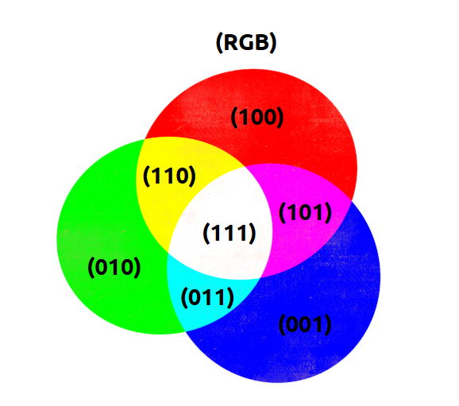

# LED RGB

A seguir desenvolvemos, passo a passo, as etapas de síntese de um programa - em linguagem C - para acender os pinos do LED RGB, presente na BitDogLab, em uma sequência específica, a fim de exibir as misturas de cores possíveis.

## Introdução:

LEDs, ou Diodos Emissores de Luz, são componentes eletrônicos que convertem energia elétrica em luz. Este processo ocorre através de materiais semicondutores que emitem luz quando energizados, o que os torna extremamente eficientes em comparação a fontes de luz tradicionais, como lâmpadas incandescentes ou fluorescentes, que além da luz emitem bastante calor.

### Tipos e Características dos LEDs:

Os LEDs estão disponíveis em uma variedade de tamanhos e cores, adaptando-se a diferentes necessidades e aplicações. Uma variação particularmente versátil é o LED RGB. Estes LEDs são capazes de emitir luz em vermelho, verde e azul, e podem ser misturados em várias combinações para produzir uma ampla gama de cores. A capacidade de controle de cor permite que sejam utilizados em displays, iluminação decorativa, sinalização, e muitos outros campos.

### LEDs RGB na BitDogLab:

A BitDogLab possui alguns LEDs coloridos, também conhecidos como LEDs RGB. Este nome vem das iniciais Red (vermelho), Green (verde) e Blue (azul). Um LED RGB possui internamente 3 LEDS, um para cada cor. Eles podem ser acesos individualmente ou então combinados para gerar uma mistura de cores.

A seguir mostramos o círculo de cores, onde as principais se misturam e criam outras cores. Observe que no centro, na mistura de todas as cores surge o branco.


## Atividade:

Vamos desenvolver um programa - em C - para acender sequencialmente o LED RGB em cores diferentes, controlando a saída digital dos pinos ligados ao LED de acordo com a ordem de cores a ser exibida, dentro do ciclo. Para isso, controlamos cada cor do LED RGB como ligada ou desligada com o uso de saídas digitais com níveis binários (alto para ligado e baixo para desligado).

## Desenvolvimento:

Para começar, vamos definir 3 variáveis binárias chamadas de R, G e B. Há inúmeras formas de implementar um algoritmo que faça com que as 3 variáveis binárias variem por todas as possibilidades de cores. Na figura a seguir, mostramos o círculo de cor com o estado esperado para as 3 variáveis (R, G e B).


Figura: Definição das variáveis booleanas para cada cor do LED, na ordem R, G e B.

Uma forma de implementar o algoritmo é usando as variáveis booleanas que descrevemos a seguir.

- Todas começam zeradas.
- Para o processamento, um algoritmo inverte B a cada ciclo, inverte G a cada dois ciclos e inverte R a cada 4 ciclos.

Assim, teremos todas as possibilidades de cores e suas misturas, sendo que, depois de zerado (RGB = 000 - apagado), temos RGB = 001 (azul), depois 010 (verde), 011 (ciano) e assim por diante até chegar no 111 que é o branco. A ordem seria:

|  R  |  G  |  B  | Cor resultante |
|:---:|:---:|:---:|:---:|
|  0  |  0  |  0  | apagado `rgb(0, 0, 0)` |
|  0  |  0  |  1  | azul `rgb(0, 0, 255)` |
|  0  |  1  |  0  | verde `rgb(0, 255, 0)` |
|  0  |  1  |  1  | ciano `rgb(0, 255, 255)` |
|  1  |  0  |  0  | vermelho `rgb(255, 0, 0)` |
|  1  |  0  |  1  | magenta `rgb(255, 0, 255)` |
|  1  |  1  |  0  | amarelo `rgb(255, 255, 0)` |
|  1  |  1  |  1  | branco `rgb(255, 255, 255)` |

## Lógica textual do código

A partir desta ideia inicial, podemos criar um fluxograma ou então uma sequência lógica textual descrevendo cada ação do nosso algoritmo. A imagem abaixo mostra a lógica no formato textual.


```ruby
inicio
    // Configuração inicial
    R <- 0 // Vermelho desligado
    G <- 0 // Verde desligado
    B <- 0 // Azul ligado

    enquanto verdadeiro faca
        // Atualiza os LEDs
        configure_leds(R, G, B)

        // Inversão lógica
        B <- nao B // Inverte B a cada ciclo
        se B = 0 entao
            G <- nao G // Inverte G quando B volta a 0
        fim se
        se B = 0 e G = 0 entao
            R <- nao R // Inverte R quando B e G voltam a 0
        fim se

        // Pausa de 500ms
        espere(500)
    Fim enquanto
fim
```

A partir deste ponto, podemos implementar o código em qualquer linguagem compatível com nossa IDE e nosso hardware. No nosso caso, vamos usar o VS Code e a BitDogLab para dar vida ao nosso exemplo. Antes de prosseguir, precisamos saber alguns detalhes de como os pinos das saídas digitais do RP2040 estão conectados com os terminais do LED RGB.

**No caso da BitDogLab:** Um LED RGB, catodo comum, tem o eletrodo do vermelho ligado no GPIO 13 através de um resistor de 220 ohm, o pino de verde está ligado no GPIO 11 também através de um resistor de 220 ohm e o pino do azul no GPIO 12 através de um resistor de 150 ohm.

## Pseudocódigo - Linguagem C

Com estas informações estruturadas, podemos passar para a etapa da escrita do código em C. Para facilitar o entendimento, separamos cada parte do programa em um bloco de código após a explicação do pseudocódigo.

**Início:** Representa o ponto de partida do programa. Incluímos um comentário inicial.

```c
/** Embarcatech - Exemplo LED RGB com a BitDogLab */
```

**Inclui Biblioteca:** Importa a biblioteca padrão para controle de GPIOs.

```c
#include "pico/stdlib.h"
```

**Função Atualizar LEDs:** Define os estados dos LEDs vermelho, verde e azul.

```c
void set_led_color(uint red_pin, uint green_pin, uint blue_pin, bool R, bool G, bool B) { 
gpio_put(red_pin, R);
gpio_put(green_pin, G);
gpio_put(blue_pin, B);
   }
```

**Início do Programa:** Configurações iniciais do sistema.

```c
int main() {
```

**Definir Pinos:** Define os pinos GPIO para os LEDs vermelho, verde e azul.

```c
const uint red_pin = 13;
const uint green_pin = 11;
const uint blue_pin = 12;
```

**Inicializar GPIOs:** Configura os pinos como GPIO.

```c
gpio_init(red_pin);
gpio_init(green_pin);
gpio_init(blue_pin);
```

**Definir Direção:** Configura os pinos como saídas digitais.

```c
gpio_set_dir(red_pin, GPIO_OUT);
gpio_set_dir(green_pin, GPIO_OUT);
gpio_set_dir(blue_pin, GPIO_OUT);
```

**Inicializar Estados:** Variáveis R, G, e B são iniciadas como desligadas (0).

```c
bool R = 0;
bool G = 0;
bool B = 0;
```

**Início do Loop Infinito:** Continua executando enquanto o programa estiver ativo.

```c
while (true) {
```

**Atualizar LEDs:** Define os estados dos LEDs com base nas variáveis R, G, B.

```c
set_led_color(red_pin, green_pin, blue_pin, R, G, B);
```

**Inverter B:** O estado de B é alternado (ligado/desligado).

```c
B = !B;
```

**Inverter G Condicionalmente:** Se B for desligado, alterna o estado de G.

```c
if (B == 0) { G = !G; }
```

**Inverter R Condicionalmente:** Se B e G estiverem desligados, alterna o estado de R.

```c
if (B == 0 && G == 0) { R = !R; }
```

**Aguardar 500ms:** Espera 500ms antes de atualizar os LEDs novamente.

```c
sleep_ms(500);
```

**Fim do Loop:** Repete o processo.

```c
}
```

**Fim do Programa:** Finaliza a execução do programa.

```c
return 0;
}
```

## Código completo em C

```c
#include "pico/stdlib.h"

// Função para atualizar os estados dos LEDs
void set_led_color(uint red_pin, uint green_pin, uint blue_pin, bool R, bool G, bool B) {
    gpio_put(red_pin, R);   // Configura o estado do LED vermelho
    gpio_put(green_pin, G); // Configura o estado do LED verde
    gpio_put(blue_pin, B);  // Configura o estado do LED azul
}

int main() {
    // Configuração dos pinos GPIO
    const uint red_pin = 13;   // Pino para o LED vermelho
    const uint green_pin = 11; // Pino para o LED verde
    const uint blue_pin = 12;  // Pino para o LED azul

    gpio_init(red_pin);
    gpio_init(green_pin);
    gpio_init(blue_pin);

    gpio_set_dir(red_pin, GPIO_OUT);
    gpio_set_dir(green_pin, GPIO_OUT);
    gpio_set_dir(blue_pin, GPIO_OUT);

    // Variáveis binárias para os estados dos LEDs - começa com todos apagados
    bool R = 0; // Vermelho
    bool G = 0; // Verde
    bool B = 0; // Azul 

    while (true) {
        // Atualiza os LEDs conforme os estados de R, G e B
        set_led_color(red_pin, green_pin, blue_pin, R, G, B);

        // Inverte os estados conforme o padrão
        B = !B;         // Inverte B a cada ciclo
        if (B == 0) {   // Se B voltar a 0, inverte G
            G = !G;
        }
        if (B == 0 && G == 0) { // Se B e G voltarem a 0, inverte R
            R = !R;
        }

        sleep_ms(500); // Aguarda 500 ms antes do próximo ciclo
    }

    return 0;
}
```

## Arquivo CMake

Lembre-se que antes de validar nosso algoritmo precisamos fazer algumas definições de compilação usando o CMake.

O arquivo CMakeLists.txt é essencial para configurar como o programa será compilado e vinculado às bibliotecas necessárias. Ele atua como uma "receita" para o CMake criar o arquivo binário final que será carregado na Raspberry Pi Pico.

Considere que o nome do projeto é "rgb_led_control".

## CMakeLists.txt

```ruby
# Define a versão mínima do CMake necessária para o projeto
cmake_minimum_required(VERSION 3.13)

# Importa as definições do Pico SDK
include(pico_sdk_import.cmake)

# Define o nome do projeto
project(rgb_led_control)

# Inicializa o Pico SDK
pico_sdk_init()

# Adiciona o arquivo principal do programa
add_executable(rgb_led_control
    rgb_led_control.c
)

# Vincula o programa às bibliotecas padrão do Pico
target_link_libraries(rgb_led_control pico_stdlib)

# Habilita a saída adicional para gerar o arquivo UF2
pico_add_extra_outputs(rgb_led_control)
```

## Exercício

Faça uma adaptação neste código em C de forma que o LED RGB implemente uma sequência de cores diferente. Varie também o tempo da sequência. Comece pelo fluxograma, depois modifique o pseudocódigo e por fim implemente e depure seu código em C. Faça um vídeo, de no máximo 15 segundos, mostrando seu funcionamento e carregue no Moodle.
